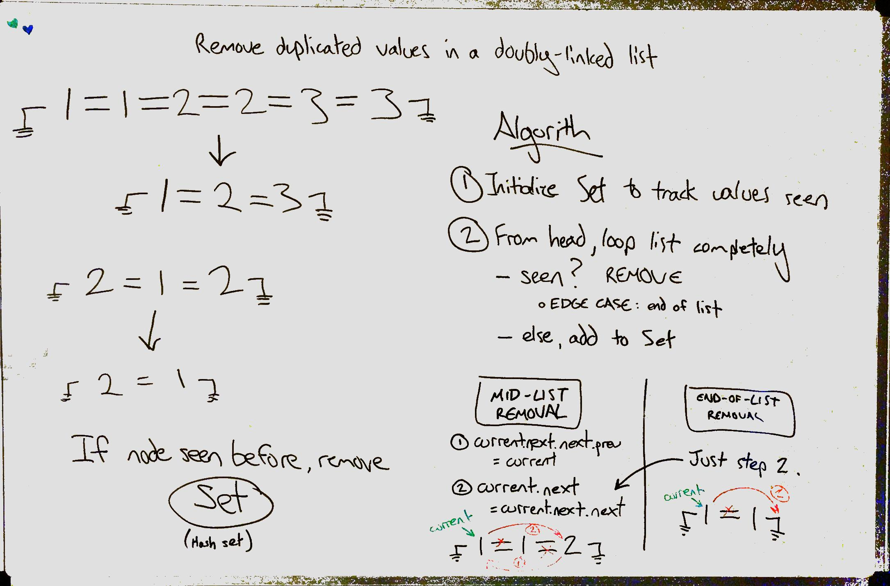
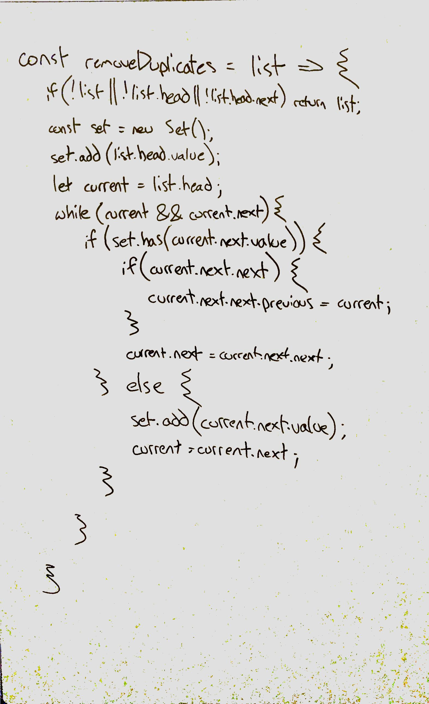

# Remove Duplicates
Remove duplicated values in a doubly-linked list.

## Challenge
Write a function which takes a doubly-linked list and removes all duplicated values from the list.

## Approach & Efficiency
This function tracks values that have been previously seen in a `Set`. If a node's value is found in the set, it is a duplicated value and the node must be removed. Because we're using a doubly-linked list, there are two references to change for any node removed from the list, except at the ends. Since the first node will never be considered a duplicate, the only edge case during removal is if the last node in the list is a duplicate.

We loop through the list using a runner, `current`, beginning at the `head` of the list. While both the current node *and* the next node are defined, `next.value` is checked. If that value exists in our set, remove it by changing the following references:
1. If `current.next.next` exists, change its `previous` reference to `current`
    - when removing the last node of a list, `current.next.next` will be `null` and we skip this step
2. Change `current`'s `next` reference to `current.next.next`

This function mutates its parameter, so there is no need to return a value.

Time complexity: O(n) - Every node in the list is checked.

Space complexity: O(n) - At worst, every node is added to the set.

## Solution

