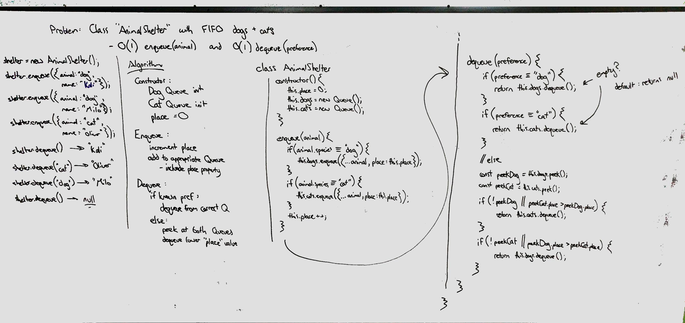

# FIFO Animal Shelter
First-in, first-out Animal Shelter.

## Challenge
Create a class called AnimalShelter which holds only dogs and cats. The shelter operates using a first-in, first-out approach.

Implement the following methods:
* `enqueue(animal)`: adds `animal` to the shelter
* `dequeue(preference)`: returns either a dog or a cat. If `preference` is not `'dog'` or `'cat'`, then return whichever animal has been waiting in the shelter the longest.

## Approach & Efficiency
I solved this by constructing the class with two Queues to manage both dogs and cats, as well as a placement counter which is added to the animal object upon enqueueing and incremented to provide a unique ID that maintains the ordering of all animals.

The `enqueue` method expects an object with a `species` attribute that can be 'dog' or 'cat'. The method adds and increments a `place` attribute to record the relative ordering of animals entering the shelter.

The `dequeue` method expects a preference string that can be `dog`, `cat`, or any other value, including null and undefined. If `dog` or `cat`, the respective animal waiting longest will be returned. Otherwise, the animal waiting longest out of both dogs and cats is returned.

Both methods have O(1) time complexity because of the Queues used internally. Using FIFO rules, we never need to loop through the data, and can return in constant time.

Space complexity per method call is O(1), expanding memory usage proportionate to the total animals in the shelter.

## Solution

