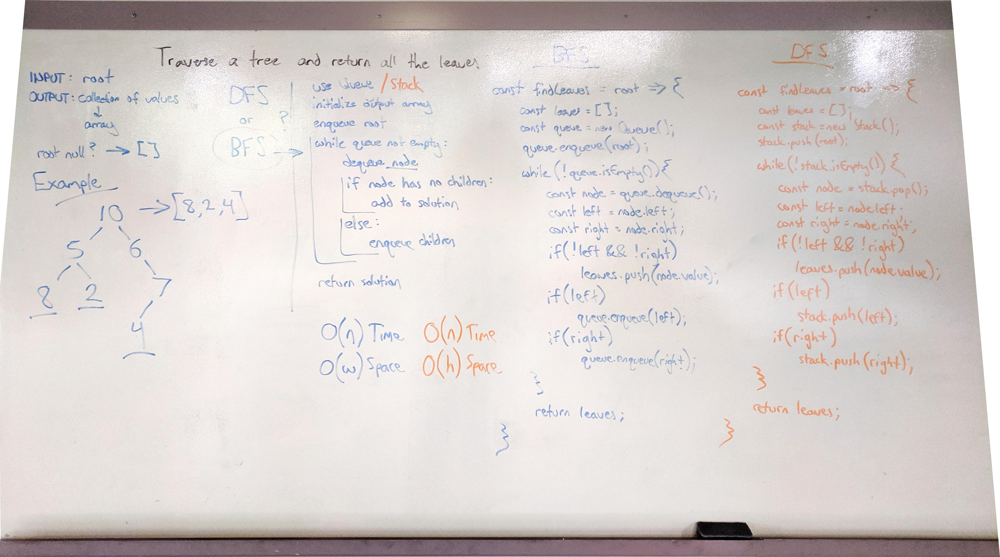

# Reverse an Array
Return all the leaves of a binary tree.

## Challenge
Write a function which takes the root of a binary tree as an argument and returns an array of every leaf node in the tree.

## Approach & Efficiency
I implemented this problem using both breadth-first and depth-first traversals, which only trivially changes the implementation. The primary difference is the use of a Stack (depth-first) or a Queue (breadth-first).

The algorithm uses an array as the output, and begins by inserting the root into its respective data structure. While that data structure isn't empty, each node is visited and checked for the existence of branches to add to the stack or queue. If there are no branches, this is a leaf, and is added to the output.

#### BFS Complexity
Using a queue, the space complexity for the algorithm is O(w), where w is the widest level on the tree (the maximum the queue will ever grow). The time complexity is O(n) because the traversal visits every node.

#### DFS Complexity
Using a stack, the space complexity for the algorithm is O(n) in the worst case, both because the largest output array scales linearly with the input size, and because the worst case height is `n - 1`. The time complexity is O(n) because the traversal visits every node.

It's worth noting that because we are using a dynamic array to store output, the `push` function is not always O(1) time. If the array needs to resize, it will factor into time complexity.

## Solution

