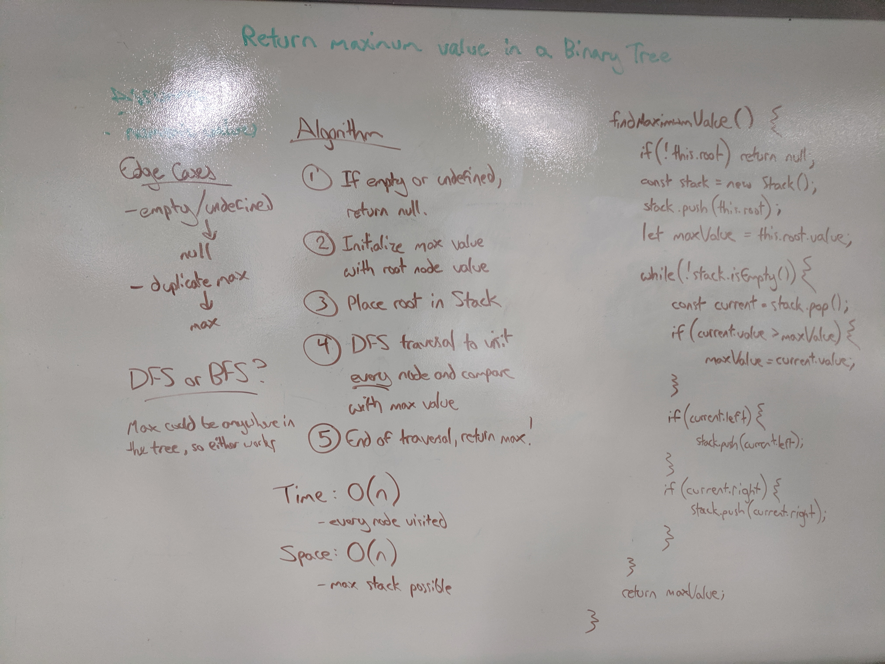

# Binary Tree: Find path length
Find the Maximum Value in a Binary Tree.

## Challenge
Write an instance method called find-maximum-value. Without utilizing any of the built-in methods available to your language, return the maximum value stored in the tree. You can assume that the values stored in the Binary Tree will be numeric.

## Approach & Efficiency
The algorithm for this method uses a basic tree traversal to visit every node in the binary tree. Because the largest value could be anywhere in the tree, there is no obvious advantage between a breadth-first or depth-first approach, and I chose DFS for a minor average gain in space complexity. The function tracks the maximum value in a variable, checking each visited node's value against it. After traversing the tree, the maximum value is returned.

Time Complexity: `O(n)` - Every node must be visited in this algorithm.

Space Complexity: `O(n)` - More concisely `O(h)`, where `h` is the height of the tree, and the maximum size of our storage Stack.

## Solution

