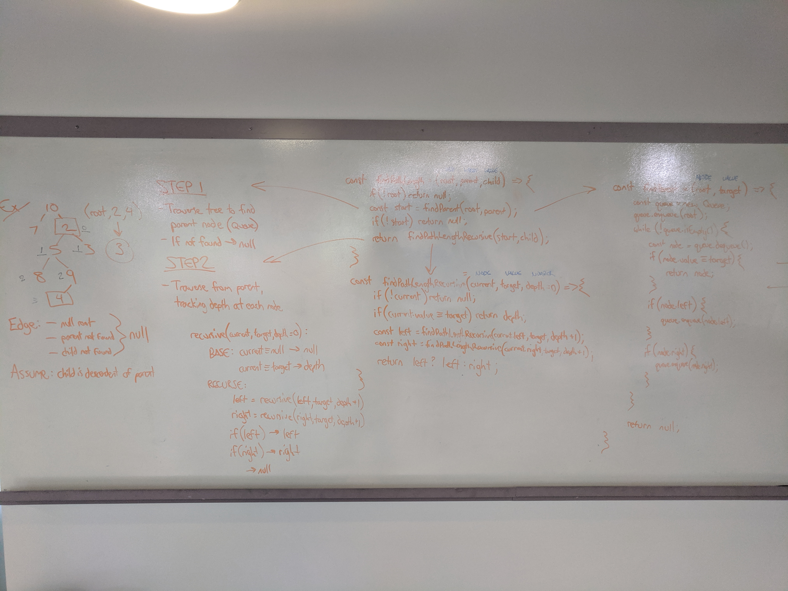

# Binary Tree: Find path length
Find the length of the path between two nodes in a binary tree.

## Challenge
Code the following signature:

const findPathLength = (root, parent, child) => {};

Assume root represents the root of a binary tree with unique integer values, and parent and children are values (not nodes!) that may or may not be in the tree.

## Approach & Efficiency
I separated the problem into two phases, because there are two distinct sections to the traversal.

#### Step 1: Find `parent`
Traverse the tree one level at a time using breadth-first search, searching for a node with the `parent` value.

I used this traversal in particular because it makes more sense to assume the `parent` node might be closer to the root. At the very least, we know it's closer to the root than `child`. Depth-first search, on the other hand, might traverse in O(n) time the opposite branch of the tree before finding its target one step from the root.

#### Step 2: Find `child`
Either the `parent` value isn't found and we return null before reaching Step 2, or we have a new `root` and associated traversal toward a `target` value. At this point, we switch to the meat of the problem: a recursive search to measure the length of the path.

At each iteration of the function, check if the current node is null. When we reach leaves, the target value has not been found, and we return null. If the current node has the target value, return the current `depth`. This parameter starts at 0 and increases with each recursive call to `current.left` and `current.right`. When the target value is found, the value is passed back down the call stack using tail recursion.

Time Complexity: O(n) - Although there are two traversal steps, the second begins where the first ends, an we at worst traverse the entire tree if `parent` is not found.

Space Complexity: O(n) - More precisely O(w), where w is the maximum width of the widest level in the tree, because it will be held in our `Queue`. The worst case is memory to hold the deepest level in a perfect binary tree, which would be approximately half of the input size, proportional to O(n) time.

## Solution

