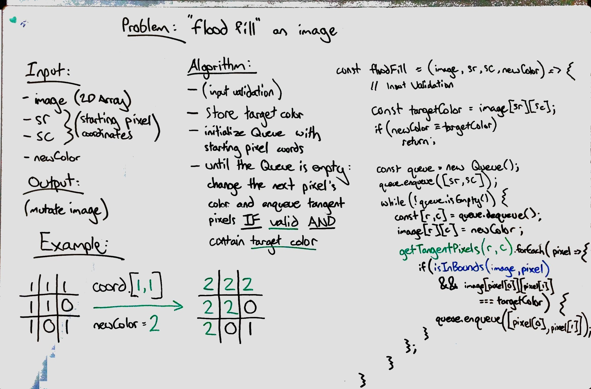
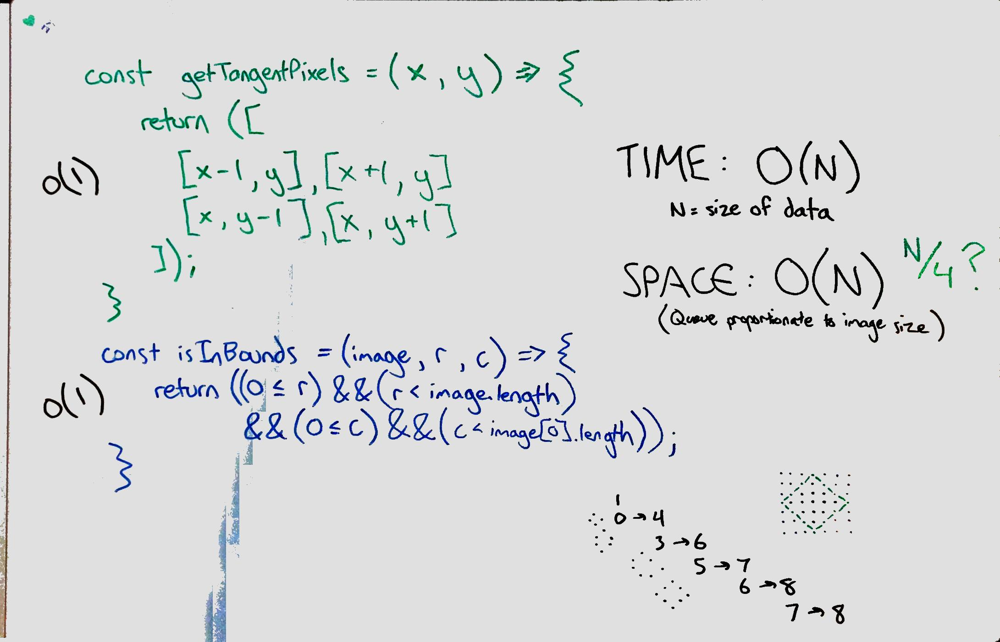

# Flood Fill
Perform a "flood fill" on an image represented by a 2-D array.

*Note: This was offered as an advanced challenge and will not reflect the code challenge presented on Canvas.*

## Challenge
An image is represented by a 2-D array of integers, each integer representing the pixel value of the image (from 0 to 65535).

Given a coordinate (sr, sc) representing the starting pixel (row and column) of the flood fill, and a pixel value newColor, "flood fill" the image.

To perform a "flood fill", consider the starting pixel, plus any pixels connected 4-directionally to the starting pixel of the same color as the starting pixel, plus any pixels connected 4-directionally to those pixels (also with the same color as the starting pixel), and so on. Replace the color of all of the aforementioned pixels with the newColor.

At the end, return the modified image.

**Note:**
- The length of image and image[0] will be in the range [1, 50].
- The given starting pixel will satisfy 0 <= sr < image.length and 0 <= sc < image[0].length.
- The value of each color in image[i][j] and newColor will be an integer in [0, 65535].

## Approach & Efficiency
This algorithm uses a `Queue` to convert tangent pixels, expanding outward from the source pixel in a breadth-first fashion. Starting with the source pixel in the queue and until the queue is empty, a pixel is dequeued, converted to the new color, and all 4 tangent pixels are checked for the target color (making sure they are within the image bounds first). Any pixels that match the target color are enqueued.

**Time Complexity: O(N)** - N is the size of the data, or the total number of pixels. In the worst case, the entire image is the target color and each pixel is scanned.

**Space Complexity: O(N)** - The `Queue` may hold pixels to a proportional degree of the total input data, representing the current 'boundary' as the pixel search spreads from the source pixel. This ends up being approximately 1/4 of the input size at its largest.

Returning a new image also requires space equal to the original image, but space usage can be optimized by mutating the original image instead.

## Solution

