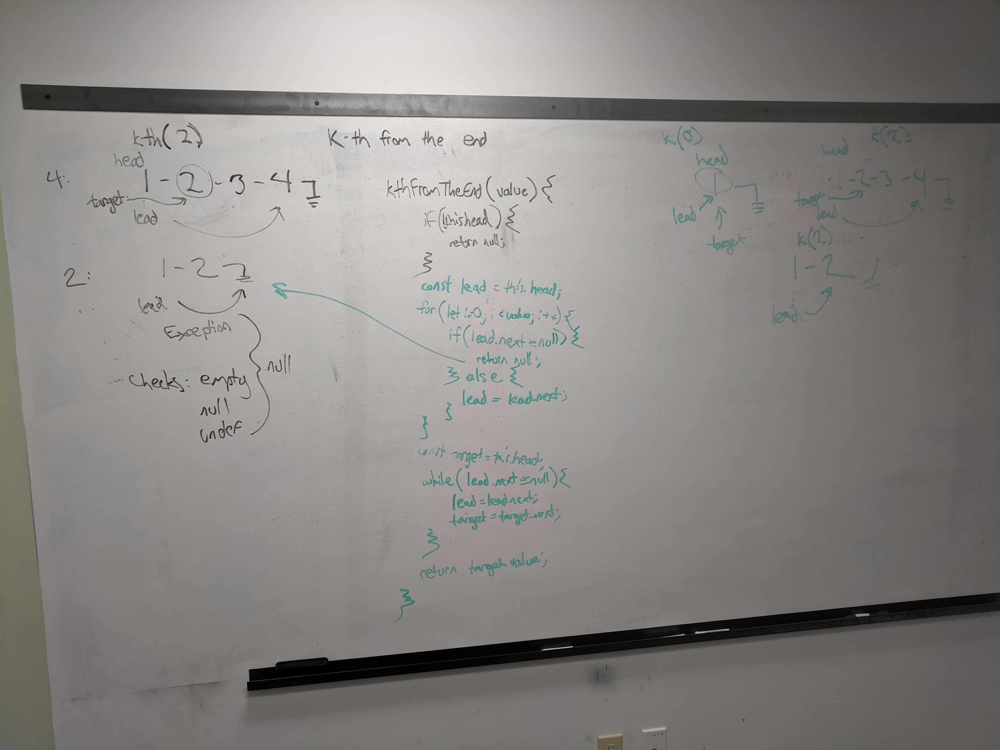

# Linked List: `kthFromEnd`
Implementation of a Linked List's method, returning the value of the Node `k`-elements from the end of the list.

## Challenge Description
Write a method for the Linked List class which takes a number, `k`, as a parameter. Return the node’s value that is `k` from the end of the linked list. You have access to the Node class and all the properties on the Linked List class as well as the methods created in previous challenges.

## Approach & Efficiency
#### `kthFromEnd()`
If the linked list is empty or undefined, or if `k` is less than 0, return null.

Starting with a `lead` referencing the head node, use `lead.next` to traverse `k` nodes. If the end of the list is reached prior to `k` calls, no node is kth from the end, so return null. Otherwise, continue to traverse both `lead` and `target` at the same rate until `lead` reaches the last node. `target` is `k` elements from the end of the list!

Time Complexity: O(n)  
Space Complexity: O(1)

## Solution

