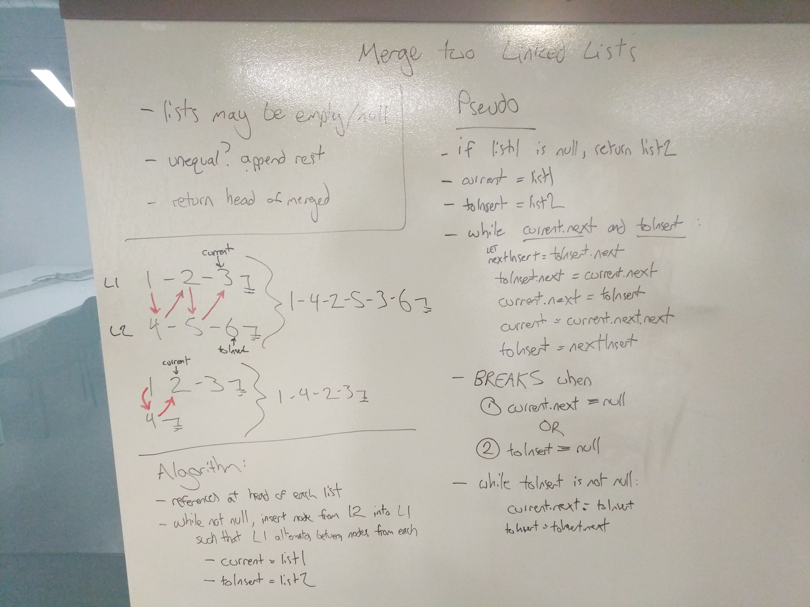

# Challenge Summary
Merge two linked lists.

## Challenge Description
Write a function called mergeLists which takes two linked lists as arguments. Zip the two linked lists together into one so that the nodes alternate between the two lists and return a reference to the head of the zipped list. Try and keep additional space down to O(1). You have access to the Node class and all the properties on the Linked List class as well as the methods created in previous challenges.

Note: Returning a reference to the list was an option, but changing the return value to a list head reference would be a trivial change in this implementation.

## Approach & Efficiency
Conceptually, the merge appears straightforward, manipulating references to alternate between the two lists. At a high level, I understood the basic algorithm to start by traversing the lists simultaneously until one reaches the end, and then link the rest of the remaining nodes, if any.

The reference manipulation ended up being slightly tricky, but the bulk of the logic hides in what to do during each step of the traversal. By having an additional 'anchor' reference, the rearrangement can be achieved in one traversal, so the time complexity of this is O(n). The space complexity is O(1) because no new memory is allocated during reference manipulation.

## Solution

