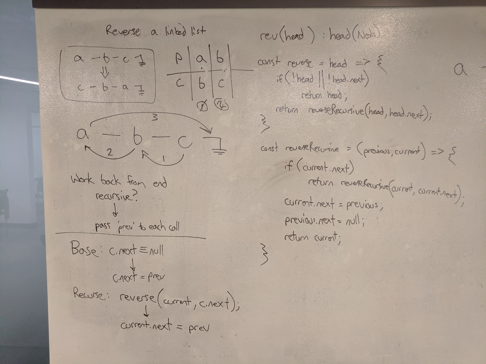

# Linked List: `reverse`
Implementation of a Linked List class method, reversing the list in place.

## Challenge Description
Reverse a Linked List in-place. You have access to the Linked List and Node classes, as well as any methods you have written.
#### Example
    Before: a -> b -> c -> null
    After:  c -> b -> a -> null

## Approach & Efficiency
#### `reverse()`
I decided that using a recursive call would simplify the problem, because the list manipulation starts from the end of the list, working back each node. This also helps guard against reference loss, since each call will hold onto a local reference to the two nodes it's manipulating.

The solution begins with by verifying the list is at least two nodes in length (the minimum to conceptually reverse a list). These two nodes are passed into the recursive call.

In the recursive function, our two parameters are neighboring nodes, `previous` and `current`. The base case is when `current` is pointing at the last node, otherwise the function is called with `current` and `current.next`. The recursive function returns a new `head` reference, which in the base case is `current`, otherwise the previously returned value from the recursive call.

The final step is reassigning node pointers. In each recursive call, including the base case, `current.next` becomes `previous`, and `previous.next` can be set to null. During recursion, each `previous` node will end up getting a new `next` reference, except for the first call -- this node is the new tail of the linked list.

Time Complexity: O(n)  
Space Complexity: O(n)

## Solution

