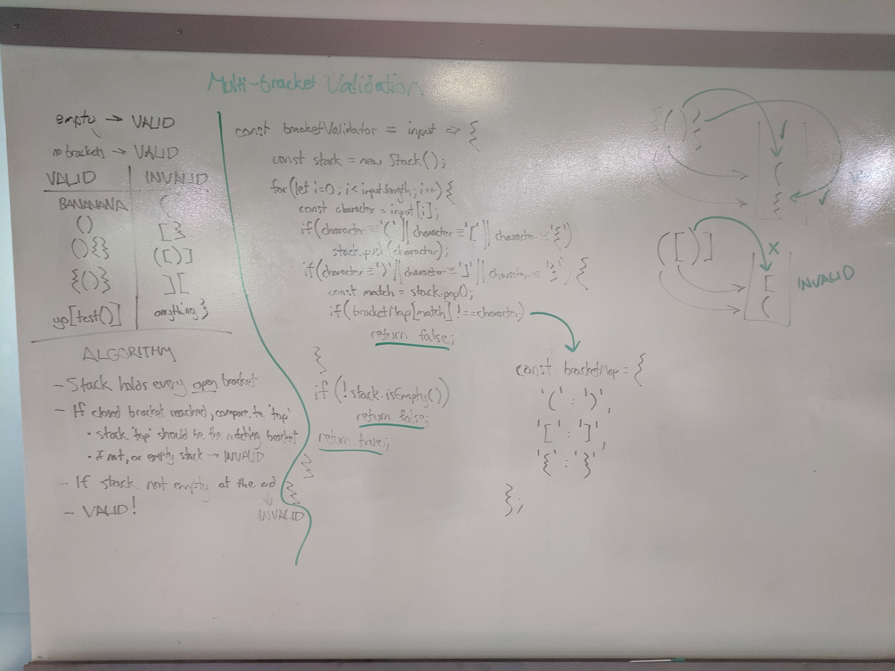

# Challenge Summary
Multi-bracket validation.

## Challenge Description
Your function should take a string as its only argument, and should return a boolean representing whether or not the brackets in the string are balanced. There are 3 types of brackets:
- Round Brackets : `()`
- Square Brackets : `[]`
- Curly Brackets : `{}`

## Approach & Efficiency
#### `multiBracketValidation(input) -> boolean`
This implementation uses a `Stack` to track all opening brackets that are expecting to be closed. To do this, a for loop reads each character and checks to see if it is a bracket.

Any opening bracket is pushed onto the stack, and every closing bracket is compared to the top value popped off the stack. As long as the two match, the input is valid.

If a closing bracket is found when the stack is empty, the input is invalid. If the end of the string is reached and there are still items on the stack, the input is invalid.

This implementation runs in O(n) time and O(n) space in the worst case. This is because we must visit every character in the input, and if the input is a string of length `n` containing entirely opening brackets (e.g. `'[[[[[[['`), then the stack will also have size `n` of allocated memory.

## Solution

