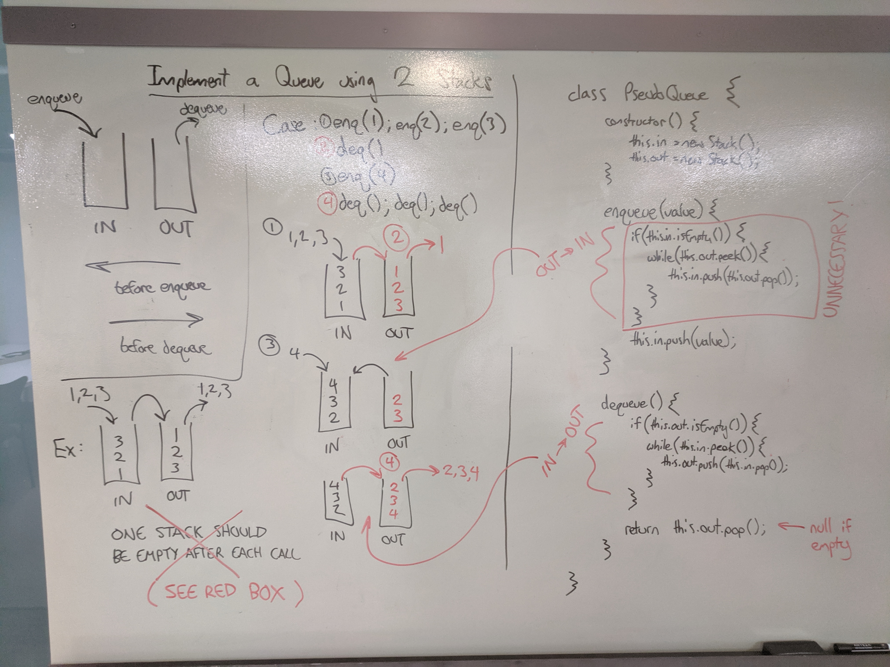

# Challenge Summary
Implement a Queue using two Stacks.

## Challenge Description
Create a brand new `PseudoQueue` class. Do not use an existing `Queue`. Instead, this `PseudoQueue` class will implement our standard queue interface (the two methods listed below), but will internally only utilize 2 `Stack` objects. Ensure that you create your class with the following methods:

- `enqueue(value)` which inserts `value` into the `PseudoQueue`, using a first-in, first-out approach.
- `dequeue()` which extracts a value from the `PseudoQueue`, using a first-in, first-out approach.

The `Stack` instances have only `push`, `pop`, and `peek` methods. You should use your own `Stack` implementation. Instantiate these `Stack` objects in your `PseudoQueue` constructor.

## Approach & Efficiency
Using two `Stack` objects, we can delegate one to handle incoming values, and the other to offer the front of the queue.

The top of the first stack can only access the 'back' of the queue, but after the entire stack is pushed into a second stack, the front value is exposed, and the rest of the values are in correct queue order.

Once the values have been shifted to the 'out' stack, new values can still be enqueued to the 'in' stack.

`enqueue(value)` has O(1) time and space complexities, because it pops one new node to the top of a stack.

`dequeue()` takes O(1) space but O(n) time in the worst case, when the 'out' stack is empty and all values are pushed onto it from the 'in' stack.

## Solution

