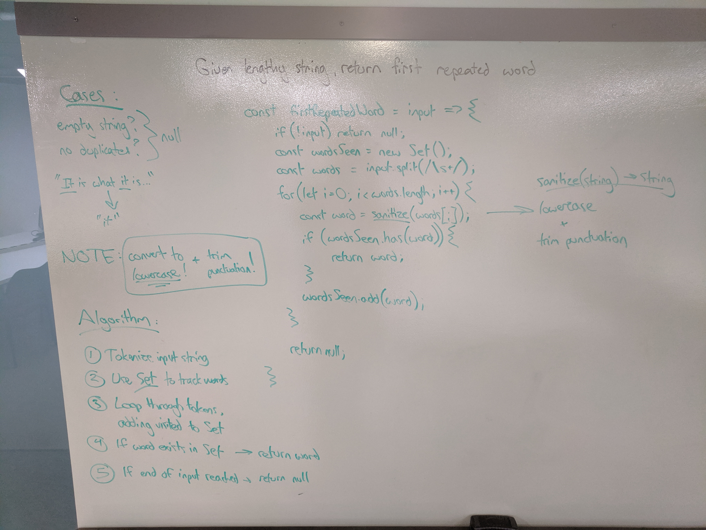

# Challenge Summary
Find the first repeated word in a book.

## Challenge Description
Write a function that accepts a lengthy string parameter. Without utilizing any of the built-in library methods available to your language, return the first word to occur more than once in that provided string.

## Approach & Efficiency
The basic idea behind this algorithm is to tokenize the input into an array of words, and then loop through those words, checking if each word has been seen before. The easiest way to check this is by using a Set, where each visited word is added, and if a word is visited that has been previously seen, it will exist in the Set. The first time this happens, we have our solution, and if no words are seen a second time, the function returns null.

Time Complexity: O(n) - In the worst case, the function loops through the entire input to see if there are any repeated words.

Space Complexity: O(n) - In the worst case, an input with no repeated words will store every word in the Set.

## Solution

