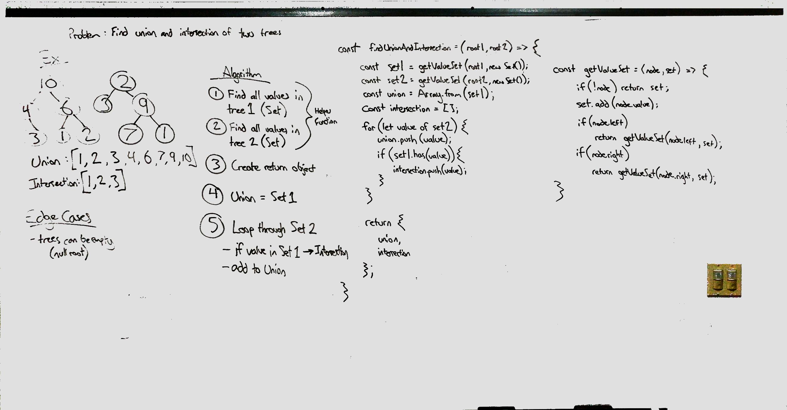

# Tree Union and Intersection
Find the union and intersection of values within two binary trees.

## Challenge
Given the roots of two binary trees, return both the union and intersection of their values. Traverse the trees using recursion, without the aid of global variables.

## Approach & Efficiency
In my solution, I created a helper function to take care of the recursive traversals, taking a tree node and a set as parameters. This function is called with each tree's root and a new `Set`, returning the set of values of each tree.

Then, arrays are created to hold the `union` and `intersection`, with the former being initialized with Set A's values. Looping through Set B, each value is added to `union` and, if also found in Set A, added to `intersection`.

Time Complexity: O(N) - More precisely O(A + B), where A and B are the number of values in each respective tree. This is because both trees must be traversed when building the sets. Set B is then looped through once more in this algorithm, although this could be prevented by building our `union` and `intersection` arrays during Tree B's traversal.

Space Complexity: O(N) - There are a few factors that contribute to the space requirements in this algorithm. First of all, the recursive technique requires O(H) space, where H is the height of the taller tree. In the worst case, this is O(N). Second, the sets require O(N) space combined since they hold every value after traversals. Finally, both the `union` and `intersection` require O(N) space, the latter in the worst case of the two trees being equal.

## Solution

